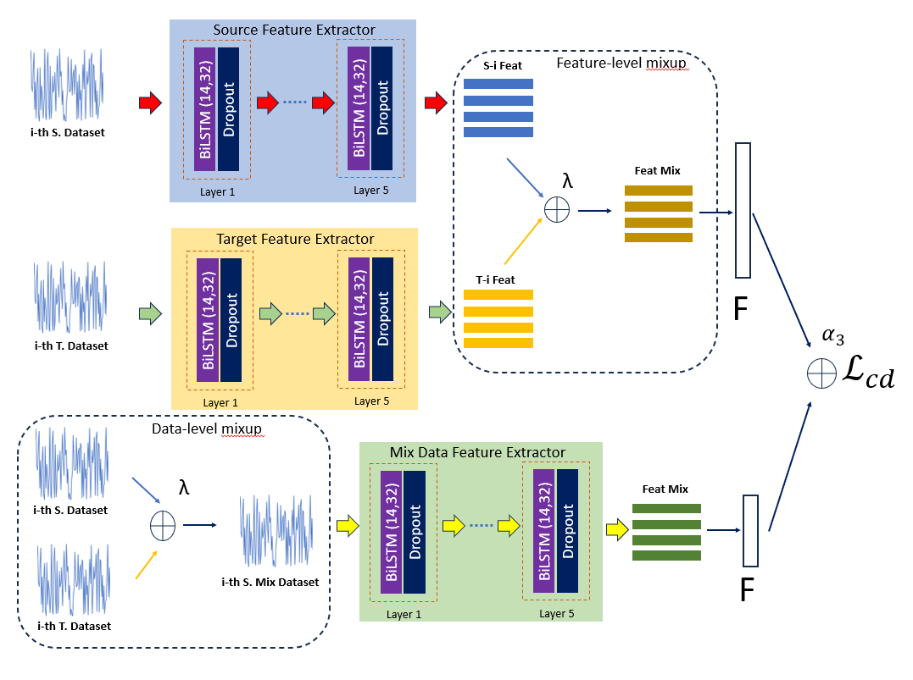

# Mixup Domain Adaptations for Dynamic Remaining Useful Life Predictions (MDAN) 

The code is based on the CADA framework that taken from https://github.com/mohamedr002/CADA

## Abstract

Remaining Useful Life (RUL) predictions play vital role for asset planning and maintenance leading to many benefits to industries such as reduced downtime, low maintenance costs, etc. Although various efforts have been devoted to study this topic, most existing works are restricted for i.i.d conditions assuming the same condition of the training phase and the deployment phase. This paper proposes a solution to this problem where a mix-up domain adaptation (MDAN) is put forward. The mix-up domain adaptation procedure encompasses a three-staged mechanism where the mix-up strategy is not only performed to regularize the source and target domains but also applied to establish an intermediate mix-up domain where the source and target domains are aligned. The self-supervised learning strategy is implemented to prevent the supervision collapse problem. Rigorous evaluations have been performed where MDAN is compared to recently published works for dynamic RUL predictions. MDAN outperforms its counterparts with substantial margins in 12 out of 12 cases.

## Requirmenets:
- Python3.8
- Pytorch==1.7
- Numpy
- Sklearn
- Pandas
- mat4py (for Fault diagnosis preprocessing)

## Datasets
### Download Datasets
We used NASA turbofan engines dataset
- [CMAPPS](https://catalog.data.gov/dataset/c-mapss-aircraft-engine-simulator-data)

### Prepare Datasets
- run_the data/data_preprocessing.py to apply the preprocessings.
- Output the data form each domain in tuple format train_x, train_y, test_x, test_y
- Put the data in the data folder

## Train the source domain model
- run python main_pretrain_source.py   

## Train the intermediate domain model
- run python main_pretrain_intermediate.py

## Train the target domain model
- run python main_pretrain_target.py

## Contact
For any issues/questions regarding the paper or reproducing the results, please contact me.   
Muhammad Tanzil Furqon    
STEM, University of South Australia (UniSA), Australia.   
Email: muhammad_tanzil.furqon{at}mymail.unisa.edu.au   
